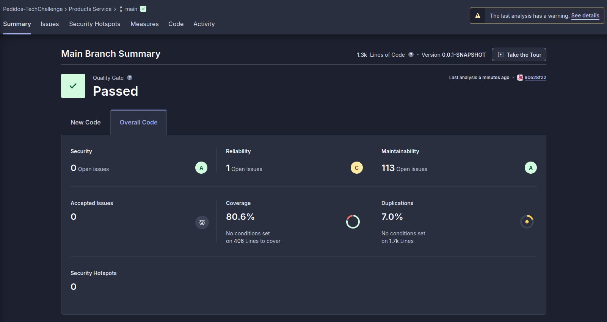

# products-service

Foto do relatório sonarcloud:

Lista dos outros repositórios:
- [VPC / Infra compartilhada](https://github.com/pedidos-techallenge/infra/tree/main)
- [Product Management Service](https://github.com/pedidos-techallenge/products-service)
- [Customer Service](https://github.com/pedidos-techallenge/client-service)
- [Order Management Service](https://github.com/pedidos-techallenge/order-management)
- [Payment Service](https://github.com/pedidos-techallenge/payment-service)

